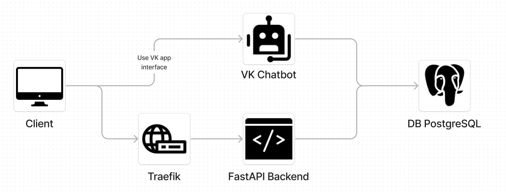
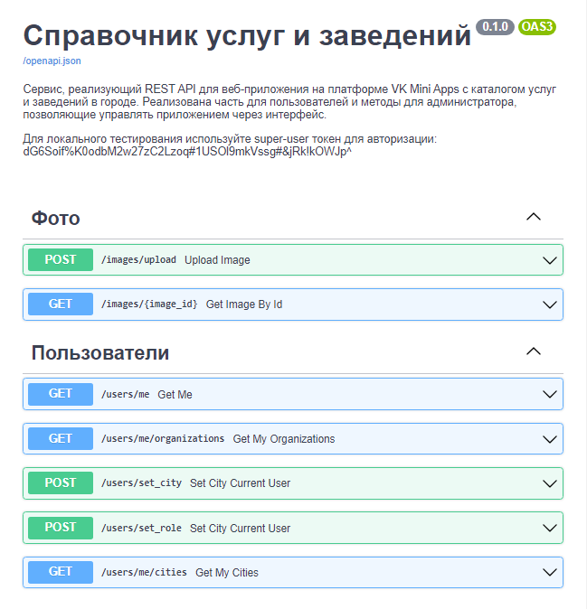

# Каталог услуг в городе (backend)


## Краткое описание
Проект представляет серверную часть приложения VK Mini Apps для просмотра организаций в своем городе. Для удобства поиска существуют категории, которые подразделяют организации на основе услуг. Проще говоря, сервис чем-то похож на раздел Авито, где пользователи размещают свои анкеты о том, какую работу могут выполнить (сантехник, парикмахер, строитель и т.п.).

При этом размещение в каталоге является платным, поэтому при добавлении информации об услугах своей организации, необходимо оформить подписку и ежемесячно продлевать. 

Администратор приложения обладает интерфейсом, который позволяет управлять каталогом организаций и мастеров, видеть статистику по доходу, блокировать пользователей.

**Дата разработки: ноябрь, 2022.**

## Что включает в себя проект
- 🚀 Rest API с автогенерируемой документацией по стандарту OpenAPI
- 💽 Взаимодействие с PostgreSQL через SQLALchemy, Alembic для создания миграций
- 🤖 Чат-бот ВК, который служит для отправки уведомлений пользователям и позволяет запускать рекламные рассылки по категориям
- 💸 Прием платежей через онлайн-кассу Robokassa
- ⚡️ Удобный и быстрый запуск через Docker Compose
- 🌐 Современный прокси-сервер Traefik для маршрутизации
- 🔧 Вспомогательные утилиты: загрузка организаций в БД из CSV, подсчет статистики по приложению используя демон, логгирование через logging


## Используемые технологии

- Python, FastAPI, VK API
- Robokassa API
- SQLAlchemy, PostgreSQL, Alembic
- Docker, Docker Compose, Traefik 

## Архитектура


#### Проект делиться на **две основные части**: чат-бот и сам бекенд.
### Чат-бот
Дополнительный микросервис, который обеспечивает работу бота в группе ВК.
Он применяется для рекламных рассылок в личных сообщениях сообщества. При старте рассылки администратор может выбрать аудиторию для рассылки: владельцы организаций или все пользователи приложения. После окончания выводится статистическая информация: сколько сообщений было отправлено.


Кроме того, бот уведомляет администратора в случае успешных пополнений баланса у пользователей. Также отправляются уведомления платным пользователям, когда им нужно продлить подписку.

**Технологии: Python, VK API, PostgreSQL, SQLAlchemy**
### Бекенд
Основная часть проекта. 

Все методы разделены на 5 роутов, каждый из которых отвечает за определенных раздел:
- **Фото**: загрузка фото (например, аватарки организаций)
- **Пользователи**: получение информации о пользователе и её редактирование
- **Общая информация**: получение информации о доступных городах, категориях и её редактирование
- **Организации**: получение информации о пользователе и её редактирование
- **Платежи**: проведение платежей через Robokassa и зачисление денег на баланс пользователя

FastAPI включает в себя автоматическую генерацию документации:


#### Авторизация
Из-за специфики платформы VK Mini Apps, для которой создавалось приложение, авторизация производится с помощью ["параметров запуска"](https://vk.com/@superappkit-vk-mini-apps), которые передаются вместе с запросом с фронтенда. Это используется вместо сессии, ведь приложение запускается напрямую во фрейме ВКонтакте.

Для грамотной проверки текущего пользователя и его роли (обычный или админ) используются middlewares от FastAPI

#### Хранение фото
Из-за требований заказчика, было решено реализовать хранение фото без отдельного хранилища, а записывать в формате base64 в базу. 

#### Платежи
Для проведения платежей используется онлайн-касса Robokassa. Фронтенд даёт ссылку на оплату пользователю, после успешной оплаты сторонний сервис присылает информацию об оплате на бекенд и деньги зачисляются.

Также есть интерфейс для администраторов, позволяющий "выдать" деньги напрямую пользователю.

#### Прокси-сервер
В качестве прокси-сервера для маршрутизации был выбран Traefik. Он современный и позволяет удобно настраивать конфигурацию из Docker.

#### Фоновые запланированные события
Настроен cron на подсчет статистики раз в определенное время. Статистика включает в себя информацию о доходах. Кроме того, раз в сутки бот проверяет пользователей, у которых скоро истекает подписка и уведомляет о продлении.

#### Дополнительные возможности
Была реализована подгрузка организаций из локального справочник в формате csv-файла.

**Технологии: FastAPI, SQLAlchemy, PostgreSQL, Robokassa API, Docker.**
## Запуск
### .evn параметры
- `POSTGRES_URL_ENV:str` - ссылка на PostgreSQL базу данных
- `CLIENT_SECRET:str` - секретная подпись мини-приложения ВК
- `APP_SECURE_KEY:str` - секретный ключ мини-приложения ВК
- `DEBUG:bool` - запуск в режиме отладки
- `LOAD_FILE_DATA_ON_START:bool` - подгружать ли данные об организациях из справочника (data.csv - пример справочник)
- `SUPERUSER_TOKEN:str` - ключ супер-пользователя, заменяет собой параметры запуска в авторизации
- `VK_GROUP_TOKEN:str` - токен группы с чат-ботом с доступом к сообщениям
- `ROBOKASSA_LOGIN:str` - логин robokassa (параметр для проверки платежей)
- `ROBOKASSA_PASSWORD:str` - пароль robokassa (параметр для проверки платежей)
- `ROBOKASSA_PASSWORD_2:str`: - пароль robokassa (параметр для проверки платежей)

Параметры запуска читаются с помощью Pydantic в `./core/config.py`. В файле также можно посмотреть значения по умолчанию.

Подробнее про VK Mini Apps и параметры запуска [тут](https://vk.com/@superappkit-vk-mini-apps).

Для работоспособности чат-бота в ВК необходимо указать токен (в файле конфигурации docker-compose, параметр VK_GROUP_TOKEN) с правом доступа на сообщения: [инструкция](https://vk.com/@vksoftred-kak-poluchit-token-soobschestva-vkontakte).
### Docker-compose (рекомендуется)
#### Локально
Для локального тестирования создан отдельный docker-compose файл: `./docker-compose.local-tests.yml`. От продакшн версии он отличается отсутствием маршрутизации.
Для запуска выполните:
```bash
docker-compose --file docker-compose.local-tests.yml up --build
```
Бекенд будет запущен на 8000 порту.

#### Продакшн
Перед запуском адаптируйте конфигурацию Traefik под свои требования.
```bash
docker-compose --file docker-compose.yml up --build
```
Сервис запустится на 80 и 443 портах.

### Вручную
1. Скачайте зависимости `pip install -r requirements.txt`
2. Разверните в локальном окружении PostgreSQL, в .env укажите ссылку на базу данных
3. Запускайте `python main.py`

